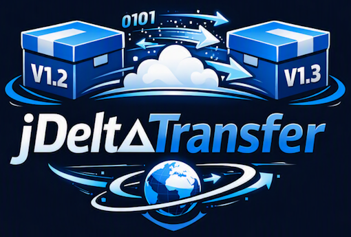

# jDeltaTransfer

Client and server for transferring successive versions of large nested archives by sending only
what actually changed.

The archives in question are nested: a container holding further archives in **ZIP**, **CAB** and
**7z** format. Any of those three may be the outermost container as well — the format is decided
by the magic bytes at every level, including the top, so file names are never trusted. Both sides
already hold an older version. The server can also serve a complete version. Every version has a
SHA-256 that both sides compute and verify, and all payload travels as self describing blocks
whose size is dynamic but bounded by a server side argument.

---

## Why a naive delta does not work here

Running rsync-style block matching over the compressed bytes of two archive versions saves
almost nothing. Changing one byte inside a file that sits in a nested 7z rewrites that 7z's whole
LZMA stream, which rewrites the enclosing ZIP entry, which changes everything from that offset
onwards. The compressed representation has no locality.

jDeltaTransfer therefore works on the **decompressed** content:

```
archive-v07.zip                          <- outer container (ZIP here; CAB or 7z work the same)
├── manifest.txt                         <- deflated entry      -> blocks of the plain text
├── content/f0001234.bin                 <- stored entry        -> blocks of the raw bytes
├── nested/data-01.zip                   <- ZIP container
│   ├── f0002001.txt                     <- deflated entry      -> blocks of the plain text
│   └── ...
├── nested/libs-02.cab                   <- CAB container (MSZIP)
│   └── f0003005.dat                     -> blocks of the raw bytes
└── nested/payload-01.7z                 <- 7z container (LZMA2)
    └── f0004010.bin                     -> blocks of the raw bytes
```

Two versions that differ in one file inside `libs-02.cab` share every block except the handful
covering the edited region, even though their compressed bytes have nothing in common.

The result of this analysis is a **blueprint**: a recursive recipe that describes how to rebuild
the original archive, byte for byte, from a set of content addressed blocks.

### Bit exact rebuilds

Decompressing is easy; re-compressing to the *identical* bytes is not. The rule here is that a
container is only taken apart if it can provably be put back together:

| format | how exactness is guaranteed |
|--------|-----------------------------|
| ZIP    | all headers, data descriptors, the central directory and any padding are kept verbatim; for each deflated entry the decomposer **probes which compression level reproduces the original stream** (aborting a candidate at the first differing byte) and records it. Entries no level reproduces — including encrypted or exotically compressed ones — keep their original compressed bytes. |
| CAB    | CFHEADER, CFFOLDER, CFFILE and CFDATA headers are kept verbatim; MSZIP blocks are re-encoded with the probed level and the same preset-dictionary chaining, and every block is compared against the original during decomposition. |
| 7z     | headers cannot be reconstructed from first principles, so the codec does a real round trip: it rebuilds the container and compares the SHA-256 with the original. Only an exact match is accepted. |

Anything that fails becomes an **opaque blob** — still chunked, still transferable, just with less
delta benefit. Correctness is never traded away.

The server additionally rebuilds every archive once after ingest and compares the hash
(`--verify`, on by default). Indexing does not need this; it is a check of the result. The checks
above are all local — one deflate stream, one CAB block, one 7z container. Nothing during
decomposition proves that the blueprint *as a whole* is right: headers and offsets across nested
containers, the order of the block references, and whether every referenced block can actually
be read back from the store. So the server rebuilds the archive from the new blueprint and its
own block store into a null stream and compares the SHA-256 with the original file. On a
mismatch the ingest fails: no blueprint is written and the version is never published.

Without the check, such a fault would surface only on the clients — every transfer of that
version would end in a failed hash check, and no client can repair it. The rebuild moves that
failure to the one place that can act on it, once per version. It costs what a client rebuild
costs, including re-encoding nested 7z archives (see `--max-7z-size` below). `--verify false`
skips it: clients still verify every result, so a fault is still caught, only later.

---

## Block transfer

Blocks are cut with **FastCDC** content defined chunking, so an insertion shifts only the blocks
around it instead of renumbering everything that follows. Block sizes are therefore dynamic:

```
--avg-block-size 64KiB    target average
--max-block-size 4MiB     hard upper bound, never exceeded by any block on the wire
```

`--max-block-size` clamps the chunker's maximum and is enforced again in the framing layer, so a
misconfigured peer cannot push an oversized frame through.

Wire format — used for delta blocks and for full downloads alike:

```
frame := 0x01 | sha256[32] | length:int32 | payload[length]
end   := 0x00 | frameCount:int64 | totalBytes:int64
```

The receiver verifies every block against its announced hash on arrival, and the trailer
distinguishes a complete transfer from a truncated one.

### Transport compression

Blocks carry **decompressed** content — that is what makes deduplication work, and it means an
uncompressed stream puts more bytes on the wire than the archive's own compressed growth. For
v01 → v02 the archive grows by 160.4 MiB while the raw block stream is 197 MiB.

So the framed stream is gzipped, negotiated with the ordinary `Accept-Encoding` /
`Content-Encoding` headers. The per block hashes are over the *uncompressed* payload, so nothing
about verification changes, and a peer that does not know about it simply gets a raw stream.

Measured on the 1 GiB chain, same 196.91 MiB of block content either way:

| | uncompressed | gzip level 1 |
|--|--------------|--------------|
| on the wire | 197.01 MiB | **171.29 MiB** |
| versus the full archive | 83.24% saved | **85.43% saved** |
| download phase | 1.1 s | 4.5 s |

**13.1% fewer bytes for about 3.4 s of CPU per 197 MiB.** That works out to a break-even link
speed near **63 Mbit/s**: below it, compression wins on wall clock too; above it, it costs time
and only saves volume — which is still the right trade on a metered link. `--no-compress` on the
client and `--compress false` on the server turn it off.

Level 1 is the default because the ratio barely improves above it while the throughput falls off:

| gzip level | of the original | throughput |
|------------|-----------------|------------|
| 1 | 78.9% | 62.1 MB/s |
| 6 | 77.2% | 39.3 MB/s |
| 9 | 77.1% | 31.5 MB/s |

Those are measured on this project's block store, which is deliberately 70% incompressible noise.
Real archives with text and code compress far better, and there the higher levels start to earn
their keep — `--compress-level` exists for that.

The uncompressed wire figure is slightly above the block content (197.01 against 196.91 MiB)
because of the framing itself: a tag, a hash and a length per block, plus the trailer.
`TransportCompressionTest` asserts that overhead exactly rather than approximately.

---

## HTTP API

Two ports. The **transfer port** carries exactly what a client needs:

| method | path | purpose |
|--------|------|---------|
| GET  | `/api/versions` | **all versions with their SHA-256 hashes** |
| GET  | `/api/versions/{id}` | one version |
| GET  | `/api/versions/{id}/blueprint` | rebuild recipe, gzipped |
| POST | `/api/versions/{id}/blocks` | requested blocks, framed (the delta) |
| GET  | `/api/versions/{id}/full` | complete archive, framed |
| GET  | `/api/config` | the block size limit the client must honour — **minimal** |
| GET  | `/health` | liveness |

The **admin port** serves all of the above plus:

| method | path | purpose |
|--------|------|---------|
| GET  | `/` | human readable version list |
| GET  | `/api/config` | the operator's **full** view: chunker parameters, store statistics, limits |
| POST | `/api/rescan` | ingest archives dropped into the archive directory |

`/api/config` is the one path that answers differently per port. The client gets two fields, the
hash algorithm and `maxBlockSize`, which is all the transfer code reads. Everything else in the
operator's view is either already in the blueprint and in a more authoritative form (chunker
parameters, the 7z limit — per version, not per current setting), stated by the response headers
per response (the transport encoding), or operational data about how much the server stores. Each
shape has its own schema, both with `additionalProperties: false`, so a field leaking from one
into the other fails `ApiContractTest` rather than production.

```
--port 8080            transfer port
--admin-port 8081      default is --port + 1
--admin-bind 127.0.0.1 loopback by default; any local address works
--no-admin             do not open it at all
```

`--admin-bind` takes any address the host actually has, so the admin port can sit on a separate
management interface rather than on loopback:

```bash
jdt server --bind 0.0.0.0 --port 8080 --admin-bind 10.0.99.5 --admin-port 9443
```

A mistyped or unavailable address fails at startup with a message naming which of the two ports
it was, rather than a stack trace — there is no silent fallback to the wildcard, which would
quietly undo the whole point. Binding admin to `0.0.0.0` is allowed but logs a warning, because at
that point only a firewall rule still separates the two halves.

The split exists so a firewall rule can keep the administrative half off the network — and the
default binding to loopback means it is unreachable from elsewhere even without one. The point is
that the transfer port does not *refuse* `/api/rescan`, it does not **have** it: an unauthenticated
endpoint that starts minutes of work has no business being reachable. The admin port also gets its
own small thread pool, so a running rescan cannot eat into the threads serving transfers.

Keeping the read-only API on both ports is deliberate. It exposes nothing the transfer port does
not already, and without it the overview page would link to dead addresses.

### TLS

`--tls-keystore` turns on HTTPS on **both** ports — an admin port on a management interface needs
encryption at least as much as the transfer port. The client follows the URL scheme.

```bash
# one-off certificate for a host answering to localhost and 127.0.0.1
keytool -genkeypair -alias server -keyalg RSA -keysize 2048 -validity 365 \
        -dname "CN=archives.example.internal" \
        -ext "SAN=dns:archives.example.internal,dns:localhost,ip:127.0.0.1" \
        -keystore server.p12 -storetype PKCS12 -storepass "$PW" -keypass "$PW"

export JDT_TLS_KEYSTORE_PASSWORD="$PW"
jdt server --tls-keystore server.p12 --archives data/archives --store data/store
```

The client needs to trust that certificate. For a privately issued or self signed one, hand it a
truststore — which pins that single certificate and is **stronger** than trusting every public
authority:

```bash
keytool -exportcert -alias server -keystore server.p12 -storepass "$PW" -file server.crt
keytool -importcert -noprompt -alias server -file server.crt \
        -keystore trust.p12 -storetype PKCS12 -storepass "$PW"

export JDT_TRUSTSTORE_PASSWORD="$PW"
jdt client fetch --server https://archives.example.internal:8080 --truststore trust.p12 \
                 --version archive-v02 --base local/archive-v01.zip --out local/archive-v02.zip
```

Passwords are read from the environment in preference to the argument, because an argument is
visible to anyone who can list processes. TLS 1.2 is the floor; nothing older is offered.

**There is no switch to skip certificate or hostname verification.** One gets added in a hurry and
never removed, and it makes the whole exercise theatre. A private certificate is supported the
correct way, above.

#### Encryption is not access control

TLS gives a confidential channel and proof the client reached the intended server. It does not
restrict *who* may ask: without a client certificate, anyone who can reach the transfer port still
gets every archive. `--tls-require-client-cert` together with `--tls-truststore` is what turns the
handshake into access control:

```bash
jdt server --tls-keystore server.p12 --tls-truststore clients.p12 --tls-require-client-cert
jdt client fetch --server https://... --truststore trust.p12 --client-cert my-client.p12 ...
```

Getting this right needed care: the JDK applies `HttpsParameters.setSSLParameters(...)` *instead of*
the individual setters, so calling `params.setNeedClientAuth(true)` alongside it is silently
ignored — the flag would have looked configured while nothing was demanded. `TlsTest` asserts that
a client without a certificate is actually turned away, which is how that was caught.

`GET /api/versions` returns, for every version: id, file name, size, `sha256`, the blueprint's
own `sha256`, block counts and the ingest timestamp.

### API Documentation

**[docs/api.md](docs/api.md)** documents every field, the error behaviour (errors are plain text,
not JSON) and the binary formats — blueprint, hash list and block stream. Machine readable JSON
Schemas are in [docs/schema/](docs/schema/); `ApiContractTest` validates the server's actual
responses and the on disk `index.json` against them on every build, so the reference cannot drift
away from the implementation.

### Persistent hashes

The server keeps its state under `--store`:

```
store/
├── index.json          version list with all hashes (atomic replace on every change)
├── blueprints/*.bp     one gzipped blueprint per version
└── blocks/
    ├── data.pack       append-only block payloads
    └── index.bin       hash -> offset/length, replayed into memory on startup
```

`index.json` records the block parameters the store was built with. Restarting with different
limits is refused rather than silently destroying deduplication (`--force-reindex` to rebuild).

---

## Building

Requires a JDK 21 or newer (developed against JDK 24).

```bash
./gradlew fatJar
```

produces `build/libs/jDeltaTransfer-1.0.0-all.jar`. The wrappers `jdt.cmd` / `jdt.sh` call it.

```bash
./gradlew test
```

runs the suite, including a full server-plus-client round trip over a real socket.

---

## Usage

### 1. Generate the test versions

Ten versions, ascending in size, starting at 1 GiB:

```bash
jdt gen --out data/archives --count 10 --start-size 1GB --growth 0.15 --threads 6
```

Every version is an outer container — ZIP by default, `--outer-format cab|7z` for the others —
holding plain files plus nested ZIP, CAB and 7z archives. Version *n+1* is derived from version
*n*: most files stay byte identical, a few get a new revision that rewrites a small region of
their content, a few are dropped, and new ones are appended until the target size is reached —
the way successive releases of a real product behave.

> This writes roughly **20 GiB**. Use `--start-size 64MB` for a quick look.

### 2. Start the server

```bash
jdt server --archives data/archives --store data/store --port 8080 --max-block-size 4MiB
```

On startup it ingests every new archive in `--archives`. Then:

```bash
curl http://localhost:8080/api/versions
```

#### Publishing a release: what "ingest" means

A release reaches clients in two steps: its archive file is put into the archive directory, and
the server **ingests** it. Ingest is the one-off preparation that turns a file into a version
clients can fetch:

1. **Detect** the container format from the magic bytes. The version id is the file name without
   its extension, so `archive-v02.zip` becomes `archive-v02`.
2. **Decompose** the archive into its blueprint, cutting the decompressed content into blocks.
3. **Store** the blocks. The store is shared by all versions and keyed by block hash, so only
   blocks no earlier release contains take up new space. For a release that changes little,
   that is a small fraction of its size.
4. **Verify** by rebuilding the archive from blueprint and store and comparing the SHA-256
   (`--verify`, see "Bit exact rebuilds").
5. **Publish**: write the blueprint and add the version with its hashes to `index.json`. Only now
   does it appear in `/api/versions`.

If any step fails, the release is not published, and no client sees a half prepared version.
The decomposition is done once per release; transfers later only read its result.

Ingest runs on server startup (unless `--no-scan`) and on request over the admin port; there is
no file watcher:

```bash
curl -X POST http://localhost:8081/api/rescan
```

Both scan the archive directory and ingest what is not indexed yet. A file counts as indexed
when its version id is in the index with the same file size and its blueprint exists.

- Copy a release in under a transient name (`.part`, `.tmp`, `.crdownload`, or a leading dot)
  and rename it when complete. Otherwise a scan can pick up a half copied file.
- Do not replace a published release in place. A file with a new size is ingested again under
  the same id, which changes a version clients may already hold. A file with the *same* size is
  not noticed at all. Publish a corrected release under a new name instead.

### 3. Fetch with the client

Full download of the oldest version:

```bash
jdt client fetch --version archive-v01 --out local/archive-v01.zip
```

Delta upgrade to the next version, using the local copy as the base:

```bash
jdt client fetch --version archive-v02 --base local/archive-v01.zip --out local/archive-v02.zip
```

The client decomposes its local base with the same rules and parameters, asks the server only for
the blocks it is missing, rebuilds, and verifies the SHA-256 against the hash the server
published before the file is moved into place.

```
jdt client list                      versions and hashes
jdt client info --version ID         details of one version
jdt client config                    server block size limits
jdt client hash --file FILE          SHA-256 of a local file
```

---

## Options

### Server

```
--archives DIR        directory holding the archive versions   (default: STORE/archives)
--store DIR           persistent hashes, blueprints and blocks  (default: ./jdt-store)
--port N              transfer port                             (default: 8080)
--bind HOST           transfer bind address                     (default: 0.0.0.0)
--admin-port N        overview page and admin commands          (default: port + 1)
--admin-bind HOST     admin bind address, any local one         (default: 127.0.0.1)
--no-admin            do not open the admin port at all
--max-block-size SZ   hard upper bound for any block            (default: 4MiB)
--avg-block-size SZ   target average block size                 (default: 64KiB)
--threads N           HTTP worker threads                       (default: cores)
--ingest-threads N    archives decomposed in parallel on scan   (default: cores/2, max 4)
--max-7z-size SZ      largest nested 7z opened up               (default: 512MiB)
--compress true|false compress the block stream                 (default: true)
--compress-level N    gzip level, 0 disables it                 (default: 1)
--tls-keystore FILE   server certificate and key; turns on HTTPS on both ports
--tls-keystore-password P     or JDT_TLS_KEYSTORE_PASSWORD
--tls-truststore FILE client certificates to accept (mutual TLS)
--tls-truststore-password P   or JDT_TLS_TRUSTSTORE_PASSWORD
--tls-require-client-cert     refuse clients without a certificate
--verify true|false   rebuild and compare after each ingest     (default: true)
--force-reindex       discard blocks and blueprints, ingest again
--no-scan             do not ingest on startup
```

### Client

```
--version ID            version to fetch
--base FILE             older local version (omit for a full download)
--out FILE              destination
--server URL            server base URL                           (default: http://localhost:8080)
--truststore FILE       certificates this client accepts (for a private server certificate)
--truststore-password P      or JDT_TRUSTSTORE_PASSWORD
--client-cert FILE      this client's own certificate, for a server requiring one
--client-cert-password P     or JDT_CLIENT_CERT_PASSWORD
--no-compress           do not ask the server to compress the block stream
--cache DIR             where the decomposed base is cached       (default: ./jdt-client-cache)
--keep-base-cache       copy the index to the new version instead of renaming it
--index-threads N       entries decomposed in parallel while indexing the base (default: min(cores, 8))
--rebuild-threads N     nested archives and deflated entries rebuilt in parallel (default: min(cores, 8))
--rebuild-as M          original (default), zip or extract; see "Giving up byte identity"
```

The cache holds one index per base file, in a sub directory named after the file's SHA-256 and
the server's block parameters. After a delta fetch that sub directory is renamed to the new
version, so upgrading one version at a time leaves exactly one behind. Nothing else prunes the
cache: with `--keep-base-cache`, or after the server's block parameters change, delete the sub
directories of bases you no longer upgrade from.

### Generator

```
--out DIR           output directory                    (default: ./archives)
--count N           number of versions                  (default: 10)
--start-size SZ     target size of version 1            (default: 1GB)
--growth F          relative growth per version         (default: 0.15)
--seed N            master seed                         (default: 20260912)
--change-rate F     fraction of files revised per step  (default: 0.03)
--remove-rate F     fraction of files dropped per step  (default: 0.01)
--threads N         versions generated in parallel      (default: min(cores, 4))
--deflate-level N   level for deflated entries          (default: 6)
```

Sizes accept `4MiB`, `64K`, `1GB` or a plain byte count.

---

## Source layout

```
com.bw.jdt.core            blueprint model, chunker, block store, decomposer, reassembler
com.bw.jdt.core.format     ZIP / CAB / 7z container codecs and the deflate level probe
com.bw.jdt.proto           block framing
com.bw.jdt.server          version store (persistent hashes) and HTTP API
com.bw.jdt.client          delta and full download
com.bw.jdt.tools           deterministic test archive generator, incl. a CAB writer

docs/api.md             API reference: JSON fields, errors, binary formats
docs/schema/*.json      JSON Schemas, checked against the server by ApiContractTest
```

---

## Measured on the generated chain

Ten versions, 1.0 GiB growing to 3.5 GiB, 20.2 GiB in total, block size average 64 KiB with a
4 MiB hard limit.

Ingest (`--ingest-threads 4`, `--verify true`): every version decomposed into exactly 10
containers — the outer ZIP, four nested ZIPs, three CABs and two 7z archives — with **zero**
opaque fallbacks, and every one passed the rebuild-and-compare check.

The shared block store holds **5.2 GiB for all 20.2 GiB of archives**, because the versions share
most of their decompressed content.

See `demo.ps1`, or `demo.sh` for the same thing outside Windows, for the script that produces the
table below: it downloads the first version in
full and then walks the chain, using each rebuilt version as the base for the next.

All tests in this Readme are measured on an AMD Ryzen 7 5700X 3.40 GHz.


| version | mode  | archive     | transferred | saved  | verified | seconds |
|---------|-------|-------------|-------------|--------|----------|---------|
| v01     | full  | 1014.97 MiB | 1014.97 MiB |   —    | OK       |   5.8   |
| v02     | delta |    1.15 GiB |  196.91 MiB | 83.25% | OK       |  57.1   |
| v03     | delta |    1.32 GiB |  264.14 MiB | 80.52% | OK       |  65.7   |
| v04     | delta |    1.51 GiB |  343.80 MiB | 77.76% | OK       |  94.3   |
| v05     | delta |    1.73 GiB |  331.29 MiB | 81.30% | OK       | 128.2   |
| v06     | delta |    1.99 GiB |  430.45 MiB | 78.87% | OK       | 153.6   |
| v07     | delta |    2.29 GiB |  473.79 MiB | 79.77% | OK       | 176.5   |
| v08     | delta |    2.64 GiB |  500.96 MiB | 81.44% | OK       | 196.1   |
| v09     | delta |    3.02 GiB |  654.58 MiB | 78.86% | OK       | 216.0   |
| v10     | delta |    3.48 GiB |  723.49 MiB | 79.68% | OK       | 239.1   |

After the initial full download, upgrading through the whole chain delivered **19.1 GiB of
archives in 3.8 GiB on the wire — 80% saved**. "verified" means the rebuilt file was hashed
independently and compared against the SHA-256 the server publishes; every step matched.

Two things are worth reading out of the table. First, a large part of each delta is not overhead
but genuine new content: version *n+1* is 15% larger than version *n* by construction, so for
v10 roughly 471 MiB of the 723 MiB transferred is data that simply did not exist before. Second,
the `seconds` column is dominated by decomposing the local base, not by the transfer. These
timings predate the cache handover described under
[Client cost, and where it goes](#client-cost-and-where-it-goes); with it, every step after the
first no longer pays for indexing at all.


## Known limits

- Multi part cabinets (`PREV_CABINET` / `NEXT_CABINET`) and Quantum/LZX compressed folders are not
  taken apart; such a cabinet is transferred as opaque blocks.
- 7z containers above `--max-7z-size` (default 512 MiB) are left opaque — see
  [Raising the 7z limit](#raising-the-7z-limit).
- ZIP archives with prepended data (self extracting stubs) whose central directory offset does not
  match the real position fall back to opaque blocks.
- All of the above are correctness preserving fallbacks; they only reduce how small a delta gets.

### Raising the 7z limit

`--max-7z-size` decides how large a nested 7z may be before it is carried as opaque blocks
instead of being opened up. The default is 512 MiB. Raising it makes deltas smaller; the price is
LZMA2 time, and it is worth knowing exactly where that time lands.

Measured with `gradlew test --tests '*SevenZCostBenchmark*' -Pbench`
(Commons Compress LZMA2, single threaded, throughput in uncompressed MB/s):

| raw content | 7z size | decompose | rebuild | rebuild MB/s |
|-------------|---------|-----------|---------|--------------|
| 16 MiB      | 10.77 MiB | 4.7 s   | 4.5 s   | 3.5 |
| 48 MiB      | 32.24 MiB | 16.9 s  | 18.6 s  | 2.6 |
| 96 MiB      | 64.42 MiB | 41.6 s  | 39.7 s  | 2.4 |

**`decompose` is a one-off per version on the server. `rebuild` is not** — the client pays it on
every single delta transfer, because putting the archive back together means re-encoding that 7z
with LZMA2. The server pays it too, on `--verify` ingest and when serving `/full` without the
original file.

At roughly 2.4 MB/s that means a 512 MiB 7z (about 768 MiB of content) already costs some five
minutes per rebuild. At 2 GiB it would be around twenty minutes — far more than transferring the
thing whole over most links.

A rule of thumb: decomposing a 7z saves about `raw / 1.5` bytes of transfer and costs about
`raw / 2.4 MB/s` seconds of CPU. The two break even at a link speed of roughly **13 Mbit/s**.
Below that, open the container up. Above it, you are trading wall clock for bandwidth — which is
still the right call on metered or expensive links, where volume matters more than time.

Two caveats:

- **The limit must match on both sides.** The client decomposes its local base to learn what it
  can derive; under a different policy it would cut different blocks out of identical content and
  the delta would collapse. That is why the limit travels inside the blueprint rather than being
  configured separately per side — the client always uses the policy that produced the blueprint
  it is fetching. Correctness is never at risk either way; only the saving is.
- Changing it does not re-decompose existing versions. Use `--force-reindex` for that, or the old
  versions keep their old policy (which is recorded in their blueprints and honoured correctly).

### Client cost, and where it goes

The intended deployment is one short lived client process per upgrade, restarted later for the
next version. Measured on the 1 GiB chain, per run:

| run | index | download | rebuild | total |
|-----|-------|----------|---------|-------|
| first ever (cold cache) | 21.2 s | 1.0 s | 10.5 s | 34.6 s |
| every later one | **0.0 s** | 1.4 s | 12.4 s | **16.2 s** |

Indexing disappears after the first run because of **cache handover**: once a transfer succeeds,
the base's block index plus the freshly downloaded blocks already describe the version just
built, so the cache directory is relabelled to that version's key. The next process finds it and
skips decomposing altogether. Renaming costs milliseconds against 25 to 30 seconds of
decomposition.

The base's own index is consumed by the handover. That is the right trade when upgrading forward
one version at a time; `--keep-base-cache` copies instead, keeping both indexed, at the price of
a full copy of the cache.

`--index-threads` (default `min(cores, 8)`) decomposes the outermost archive's entries in
parallel. It is worth less than it looks: 30.1 s single threaded against 23.7 s on sixteen, a
speedup of only 1.27. Roughly three quarters of indexing is serial, because the deflate level
probe runs inside the ZIP codec before the parallel section begins — the mirror image of the
rebuild problem described next, and fixable the same way. It was left alone because with handover
in place indexing only ever runs once per machine.

`--rebuild-threads` (default `min(cores, 8)`) attacks the phase that runs on *every* transfer.
Two independent things happen in parallel:

- the nested archives, which are independent subtrees, are rebuilt concurrently;
- the outer archive's own deflated entries are pre-compressed concurrently. ZIP entries share no
  compression state, so each can be deflated on its own thread and the results written out in
  order. Small results stay in memory, larger ones go to a temp file, so pre-compressing a
  multi gigabyte archive does not need a multi gigabyte heap.

The second half is what actually pays. Parallelising only the nested archives got 28.2 s down to
21.7 s, a mere 1.30, because re-deflating the outer archive's own entries is a longer serial
stretch than all the nested archives put together. With both in place:

| rebuild-threads | 1 | 8 | 16 |
|-----------------|---|---|----|
| rebuild | 27.9 s | 11.0 s | 10.0 s |
| speedup | — | 2.54 | 2.79 |

The rebuilt archive's SHA-256 is identical at every thread count, which `ParallelRebuildTest`
pins down by comparing a serial and a parallel rebuild byte for byte.

### Which format sits on top

Any of the three. The server discovers versions by sniffing each file's magic bytes, so a cabinet
called `bundle.pak` or a ZIP with no extension is ingested just the same; only obviously transient
names (`.part`, `.tmp`, dotfiles) are skipped. `jdt gen --outer-format zip|cab|7z` produces the
same content under each, and `TopLevelFormatTest` checks all three decompose, rebuild byte for
byte, and keep their delta — block reuse between consecutive versions is **92% in every case**.

One sharp edge: the version id is the file name without its extension, so `app.zip` and `app.7z`
would collide. The scan reports that and skips the second rather than letting one silently replace
the other in the index; rename one to serve both.

#### 7z on top is the expensive choice

The delta itself holds up — the outer solid stream is taken apart rather than treated as one
blob — but the rebuild does not.

Measured on a 126 MiB top level 7z with nine nested archives inside:

| what | time | vs serial | output |
|------|------|-----------|--------|
| bit exact rebuild, 1 thread | 40.6 s | — | 126.65 MiB |
| bit exact rebuild, 8 threads | 39.6 s | 1.03 | 126.65 MiB |
| bit exact rebuild, 16 threads | 36.9 s | 1.10 | 126.65 MiB |
| `--rebuild-as zip` | **3.0 s** | **13.3** | 151.88 MiB |
| `--rebuild-as extract` | 3.8 s | 10.6 | 151.86 MiB |

**Threads buy almost nothing on the bit exact path**, and no amount of engineering will change
that. 7z packs its entries into a single solid LZMA2 stream, so unlike ZIP entries they are not
independently compressed and cannot be re-encoded independently either. The nested archives inside
still rebuild concurrently, but they are a rounding error next to one sequential LZMA2 pass over
the whole container. 40.6 s for 126 MiB extrapolates to roughly five minutes per gigabyte, on
every transfer, on the client.

`--max-7z-size` also applies to the outermost container. Above it the entire archive becomes one
opaque blob and the delta collapses to a full transfer — still correct, but pointless. A multi
gigabyte top level 7z therefore needs that limit raised, which costs exactly the LZMA2 time above.

### Giving up byte identity on purpose

The last two rows are the way out, and they are a different promise. `--rebuild-as` decides what
the client ends up with:

| mode | result | verified against |
|------|--------|------------------|
| `original` (default) | the archive, byte for byte | its published SHA-256 |
| `zip` | a ZIP with stored entries | every member's content, per member |
| `extract` | the members as files in a directory | every member's content, per member |

The repacked output is deliberately **not** the original file and does not carry its SHA-256 —
there would be no point pretending otherwise. What still holds is that every byte came from a
block whose hash was checked on arrival, and that each member was written with exactly the content
the blueprint describes; `Repacker.verifyEntries` re-reads the output and compares member by
member. `RepackTest` pins that down for ZIP and 7z on top by reading the bit exact rebuild and the
repack side by side and asserting they agree on every member. There is no CAB reader here to read
the reference with, so for a cabinet the two repack shapes are compared against each other.

All three container formats can be listed, so `--rebuild-as` works whatever sits on top. Four
things to know before using it:

- **It costs disk.** Stored entries mean no compression: 151.88 MiB against the original 126.65
  MiB here, and the gap widens the better the original compressed. Re-deflating instead would give
  back some of that and hand back most of the 13x, which is why `zip` stores rather than deflates.
- **A repack cannot be the base of the next delta**, so the client keeps the cache under the base's
  own key instead of handing it over. The next upgrade from the same base still reuses its index.
- **Nested archives stay whole.** Each is rebuilt bit exactly and written as one member; only the
  outermost container changes shape. Nothing is unpacked recursively.
- An outer container that was left **opaque** — a 7z above `--max-7z-size`, say — has no members to
  work from, so the client falls back to the original format with a log line. The output is
  correct, just not the requested shape.

ZIP on top with 7z nested inside needs none of this: the outer entries parallelise, and the nested
7z containers are small enough for their solid streams not to dominate.

One thing the handover cannot do: seed a cache from a `/full` download. Those blocks are cut over
the *compressed* archive stream and live in a different block space than the blueprint's
decompressed blocks, so the first delta after a full download always has to index its base.
